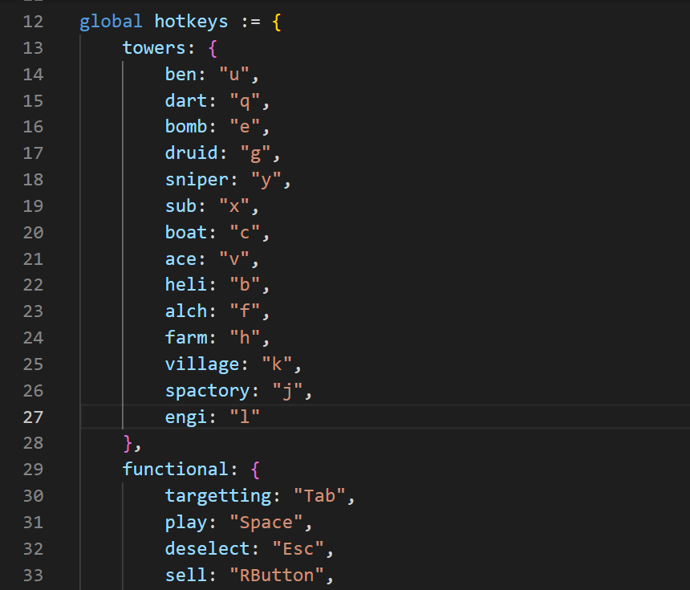

# Strategy Creation Guide

This guide will teach you how to implement your own strategies into my scripts, e.g. Event Grinder or Insta Grinder.

## Setting up your development environment
### **AutoHotkey**
If you don't already have AHK installed, get it [here](https://www.autohotkey.com/) and install it.

### **Text Editor**
To edit the script, you'll need a proper text editor; the default Windows Notepad won't be sufficient. In the following steps I'll show you how to install and setup [VSCodium](https://vscodium.com/), a public fork of Microsoft's [VS Code](https://code.visualstudio.com) without Microsoft's trackers.

#### **Installation**
- Open a command line by pressing Win + R, typing in `cmd` and pressing Enter.
- Type `winget install vscodium`, press Enter and accept the Terms and Conditions.

#### **Setup**
- Press Win + R once again, type `%APPDATA%/VSCodium` and press Enter.
- In the opened folder, create a new file called `product.json` and open it up with a text editor (e.g. VSCodium). Past the following in there:
  ```json
    {
    "extensionsGallery": {
            "serviceUrl": "https://marketplace.visualstudio.com/_apis/public/gallery",
            "itemUrl": "https://marketplace.visualstudio.com/items",
            "cacheUrl": "https://vscode.blob.core.windows.net/gallery/index",
            "controlUrl": ""
        }
    }
- Save the file, close your text editor and freshly open up VSCodium.
- Click at the Extensions symbol (the 5th one on the left) and install "AutoHotkey v2 Language Support" by thqby.
- 

## Getting Started
Now that our text editor is set up, let's get started by opening [this template](./template.ahk) in VSCodium. In this tutorial, we will build a Cubism Easy Grinder. Of course that doesn't make sense, but afterwards you can use your new knowledge to build an Impoppable Grinder or implement some new Impoppable strategies in the Event Grinder script.

Let's start in the top at the hotkeys section. Only the towers listed in here can be used in your strategy. (But don't worry, i'll add more in the future.)
