# Strategy Creation Guide

This guide will teach you how to implement your own strategies into my scripts, e.g. Event Grinder or Insta Grinder.

## Setting up your development environment
### **AutoHotkey**
If you don't already have AHK installed, get it [here](https://www.autohotkey.com/) and install it.

### **Text Editor**
To edit the script, you'll need a proper text editor; the default Windows Notepad won't be sufficient. In the following steps I'll show you how to install and setup [VSCodium](https://vscodium.com/), a public fork of Microsoft's [VS Code](https://code.visualstudio.com) without Microsoft's trackers.

#### **Installation**
- Open a command line by pressing Win + R, typing in `cmd` and pressing Enter.
- Type `winget install vscodium`, press Enter and accept the Terms and Conditions.

#### **Setup**
- Press Win + R once again, type `%APPDATA%/VSCodium` and press Enter.
- In the opened folder, create a new file called `product.json` and open it up with a text editor (e.g. VSCodium). Past the following in there:
  ```json
    {
    "extensionsGallery": {
            "serviceUrl": "https://marketplace.visualstudio.com/_apis/public/gallery",
            "itemUrl": "https://marketplace.visualstudio.com/items",
            "cacheUrl": "https://vscode.blob.core.windows.net/gallery/index",
            "controlUrl": ""
        }
    }
- Save the file and close your text editor.
  
  
- Freshly open up VSCodium.
- Click at the Extensions symbol (the 5th one on the left) and install "AutoHotkey v2 Language Support" by thqby.
  

## Getting Started
Now that our text editor is set up, let's get started by opening [this template](./template.ahk) in VSCodium (File ➡ Open File...). In this tutorial, we will build a Balance Easy Grinder. Of course that doesn't make much sense, but afterwards you can use your new knowledge to build an Impoppable Grinder or implement some new Impoppable strategies in the Event Grinder script.

Let's start in the top at the hotkeys section. Only the towers listed in here can be used in your strategy. (But don't worry, i'll add more in the future.)
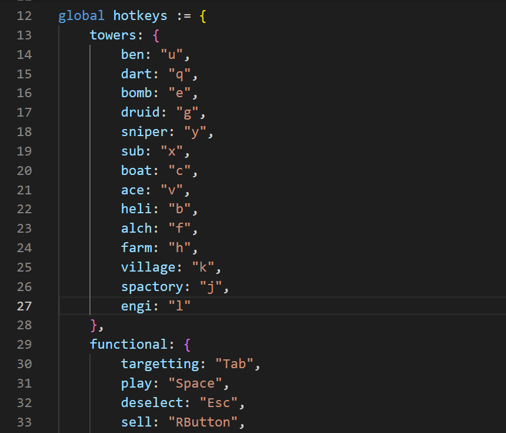

If you scroll down further, on line 180 you can see the begin of the current strategy, which is a Cubism Impoppable strategy. Since we want our strategy to be on Balance Easy, let's call our map balance and set the gamemode to easy. Currently only easy (standard) and impoppable are supported, but I will add more upon request.
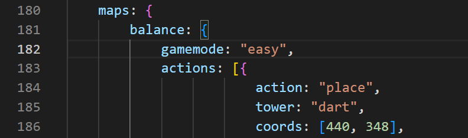

Below, you can see a list called "actions" which contains a bunch of items, which each represent an ingame action. The script will execute all actions in that list in order. Let's empty it by deleting lines 184-407.
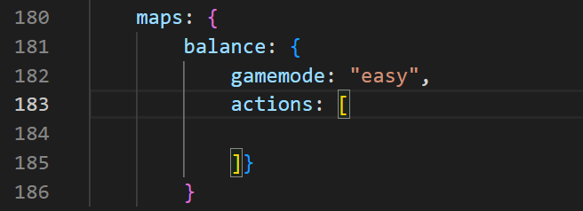

Before we start adding in our own actions, let me quickly teach you how to get the pixels of your tower positions. Start by going to Balance Sandbox Mode. Now open up "Autohotkey Window Spy" which comes with AHK v2.0.
In this window, the "Client" value in the Mouse Position section tells you the current coordinates of your mouse in the scope of your currently selected window (➡ BTD6 if you select it). Now when you're in the game and hovering a tower to place, it will tell you the coordinates we'll need later.
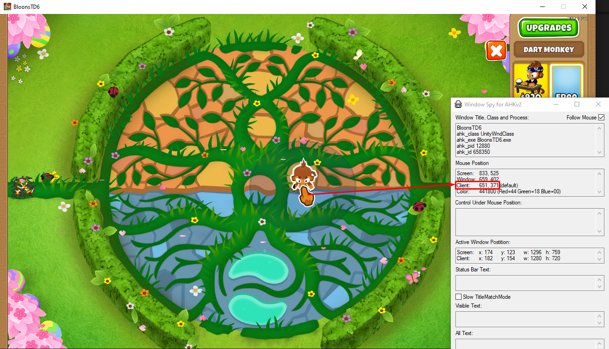

Now let's start building our strategy. The first action (and the only one we can do in the beginning) is placing a tower. A tower placement action looks as following:
```json
{
    action: "place",
    tower: "engi",
    coords: [440, 348],
    test: false,
    testColor: "0xFFFFFF",
    targetting: 0,
    upgrades: [
        {path: 2, amount: 1}
    ]
}
```

Copy-paste it inside the actions list and adjust the values like following:
- tower: Specifies the tower to be placed. Let's start with our free dart, so we need to put `"dart"` there.
- coords: Specifies the coords at which the tower get's placed. Let's put it next to the middle to the right; the coordinates `[645, 382]` are fitting for that.
- test: If true, waits for the position to be the color stored in testColor before placing the tower (useful for moving platforms etc.). We don't need that, so let's leave it as is.
- targetting: Specifies the amount of the targetting hotkey getting pressed (right after placing and selecting the tower). Setting the Dart to Close sounds like a good idea, so let's set it to `2`.
- upgrades: Contains a list of all the upgrades to be done to the tower after placing it. We don't want to upgrade the dart monkey for now, so let's empty that list.
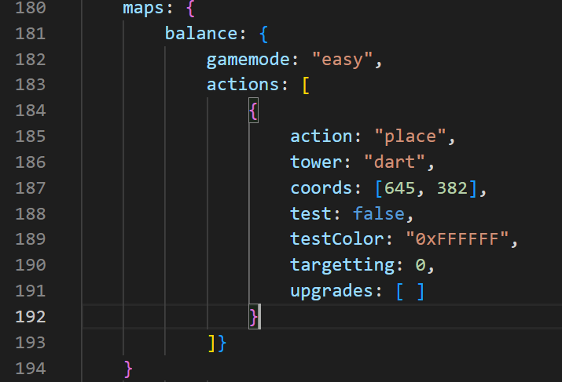

Next, let's place Ben to make some money. To append another action to the actions list, you just need to put a comma after the closing bracket and can paste another one right behind. Do that, choose coordinates to the right of the middle circle and adjust all the values by yourself to get the hang of it. Your file should look something like this now:
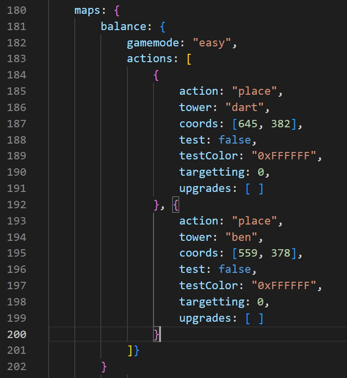

Next in our strategy, we want to place a boat to farm some money. Let's upgrade it 010 ➡ 013 ➡ 023 ➡ 024.
In order to do all that, let's first append another "place" action to the actions list and adjust all the values we already know about. Now about the "upgrades" section: It contains a list of the updates being done to the tower in the following format:
```json
{path: 2, amount: 1}
```
For multiple upgrades, you append them to your list with commas just like with the actions. Our upgrades list on the boat should look like this:
```json
{path: 2, amount: 1},
{path: 3, amount: 3},
{path: 2, amount: 1},
{path: 3, amount: 1}
```
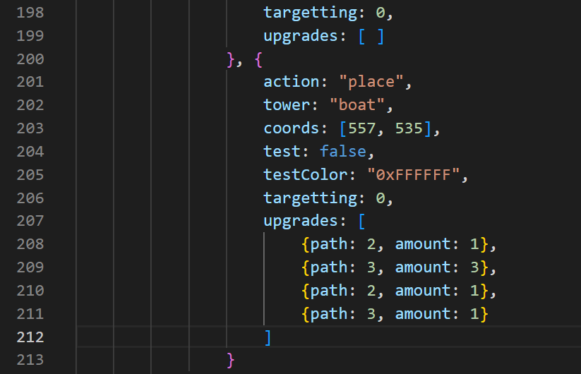

We know how to use the "place" action now, so let's upgrade the dart monkey to a 402 using the "upgrade" action. It looks like this:
```json
{
    ;ace
    action: "upgrade",
    coords: [539, 321],
    upgrades: [
        {path: 1, amount: 1}
    ]
}
```

The comment (comments in AHK start with a `;`) stating the tower is optional but recommended to keep track of what you're doing. As you can see, it's pretty much just an extract from the "place" action with only the info needed to upgrade. Let's add it to the actions list and adjust everything as we need. For the coordinates, use the exact coordinates you already used for the dart. I'll show you why in a few steps.
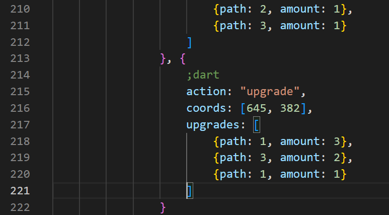

Now, let's sell our boat and save up for ultra juggernaut. For selling, we need a sell action. It looks like this:
```json
{
    ;sub
    action: "sell",
    coords: [578, 185]
}
```
Same thing with the comment. Let's add the selling action and then another upgrade action for the dart.
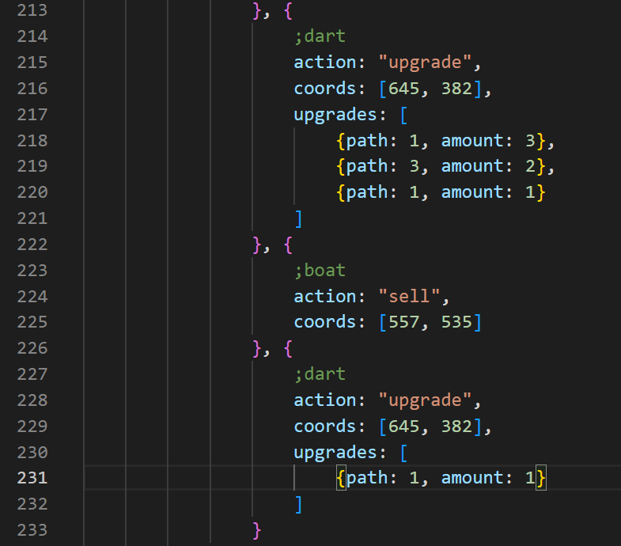

Now there's just one last thing to do. In the section called "8" (should be line ~370 as of now) there is a method call `map := selectMap("beginner", 3, 6, "cubism")`. We need to adjust it to our map. The 4 values mean:
- The map difficulty
- The page the map is on within the difficulty
- The position of the map within that page
- The name you gave the map in the very beginning (Line 181)

Balance is an Intermediate map in the 6th position on the first page, so we need to adjust it to `map := selectMap("intermediate", 1, 6, "balance")`.

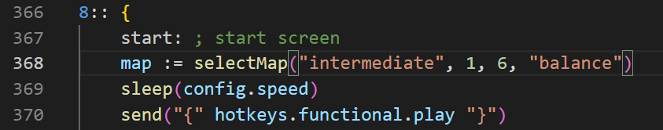

Now, before you run away and test your script, let me really quickly show you what to do if you change your mind about a tower and want it at a different position. For our example, lets say we suddenly want our our dart on the other side of the circle. Instead of finding and adjusting every single place, upgrade and delete action about that dart, instead you can use this trick: [471,378]
- Select the coordinates anywhere in the script and press Ctrl + F.
- In the search window in the top right, click the arrow on the left.
- In the lower text field, enter your new coordinates and click the "Replace all" button.
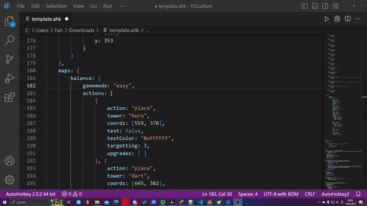

Now, if you followed the tutorial along well, you should have a working Balance Easy Grinder! To try it, either click the play button in the top right or just double click it in the file explorer as usual; then go to the home screen and press 8. If you didn't get what a specific part of the script should look like now, find the finished script we just build [here](./tutorial.ahk).

## Happy scripting!